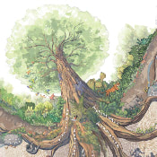

  

# Racines de résilience

Le site Racines de résilience est une des facettes de la campagne d'accompagnement du film Une fois que tu sais, écrit et réalisé par Emmanuel Cappellin, en collaboration avec Anne-Marie Sangla. Cette campagne est portée par l'association Terractiva, créée en 2019 pour défendre une adaptation globale face aux processus d'effondrements en cours. Sa mission : accompagner des objets artistiques particulièrement impactants auprès du grand public et soutenir un changement culturel à grande échelle.

## Airtable

Les actions sont stockées dans plusieurs bases Airtable de la manière suivante :

-   1 base pour chaque arbre (3 actuellement)
-   1 base pour chaque langue contenant les actions de la communauté (2 actuellement)

Ces actions sont récupérées par Kirby via l'API Airtable puis transformées en page. Chaque base possède son propre cache pour 2 raisons :

-   l'API Airtable est lente et retourne 100 résultats maximum par requête, une base contenant plusieurs centaines d'actions prend facilement une dizaine de secondes à charger
-   Airtable [a introduit](https://support.airtable.com/docs/changes-to-airtable-plans) un quota mensuel de 1000 appels API par mois

Le cache ayant une durée de vie de 24h et chaque base un maximum de 1000 entrées, le site peut faire jusqu'à 1500 appels API par mois. Pour l'instant les bases sont remplies à environ 40%, cela ne pose donc pas de problème.

## Utilisation

### Commandes

-   `npm run dev` compile une version de développement des ressources CSS et JavaScript à chaque changement effectué
-   `npm run build` compile une version de production des ressources CSS et JavaScript

### Développement

[IndigoStack](https://indigostack.app/) (disponible seulement sur macOS) est utilisé pour faire tourner le serveur de développement, il suffit d'y importer le fichier [`stack.indigostack`](./stack.indigostack) et de faire pointer les noms de domaine vers le dossier du dépôt dans la configuration Apache (Racines de résilience > Apache > Edit site... > Root).

Il suffit sinon de l'héberger sur un serveur avec PHP 8.2 sur les adresses suivantes : https://www.racinesderesilience.development et https://www.roots-of-resilience.development.

### Déploiement

1. `ssh ftp_user@ftp_address`
2. Commit les changements en attente
3. `git pull`
4. `git submodule update --init --recursive`

## Licence

Réalisé avec [Kirby](https://getkirby.com/) et [Bulma](https://bulma.io/).

Le code source est placé sous licence [CC BY-SA 4.0](https://creativecommons.org/licenses/by-sa/4.0/deed.fr).

Les images sont la propriété de [Théotime Noël](https://www.theotimenoel.com/) et l'Arbre aux actions de l'association Terractiva.

Les contenus de toutes les actions référencées appartiennent à leurs structures respectives.
